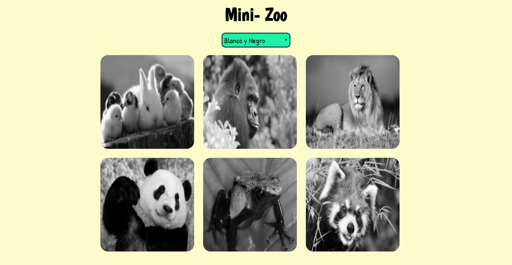
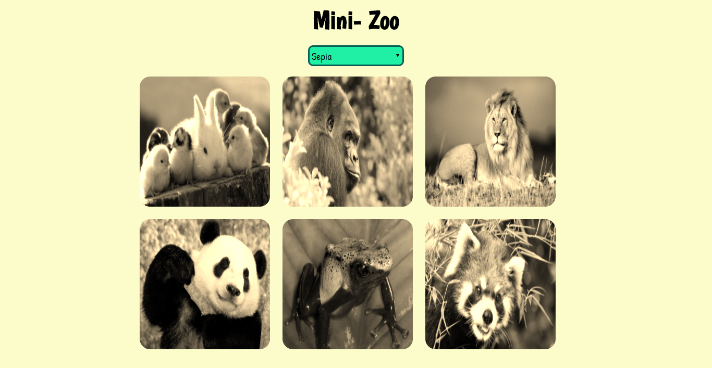
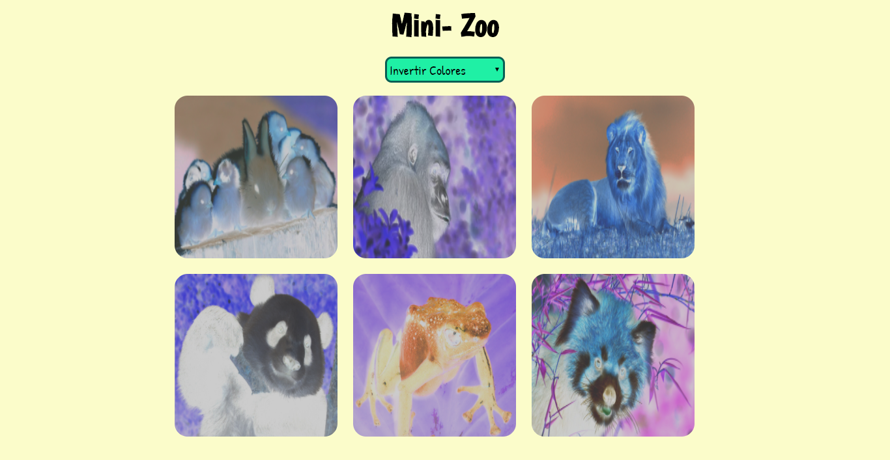
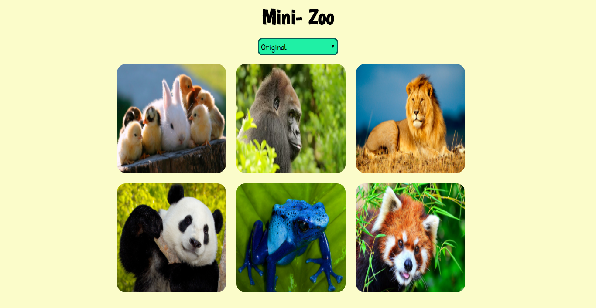

# MINI-ZOO
---

## Ojetivo

Esta página permite elegir efectos como sepia, blanco y negro e invertir colores que deseamos que obtengan nuestras imágenes. Estos eventos se realizan con JS ,CSS y HTML.

## Especificaciones

- Utilizar la etiqueta selector para habilitar el combo-box con 4 opciones
- Mediante el DOM agregar 4 eventos de acuerdo a la opcion elegida.
- Si se posiciona en Blanco y Negro , se debe visualizar :

- Si se posiciona en Sepia , se debe visualizar :

- Si se posiciona en invertir colores , se debe visualizar :

- Si se posiciona en Original , se debe visualizar :

